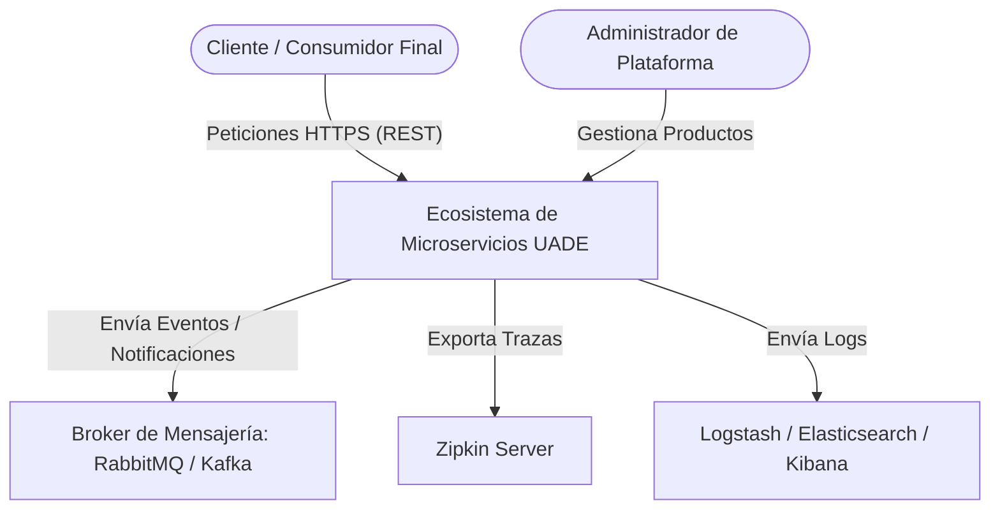

# UNIVERSIDAD DE LA EMPRESA (UADE)
## Facultad de Ingeniería y Ciencias Exactas
## Arquitectura de Aplicaciones

---

# DOCUMENTO DE ARQUITECTURA DE SOFTWARE (SAD)
## Ecosistema de Microservicios Distribuidos y Mensajería Asincrónica

**Curso:** Arquitectura de Aplicaciones  
**Cuatrimestre:** Primer Cuatrimestre de 2026  
**Proyecto:** Extensión de Ecosistema Core de Microservicios con Arquitectura Hexagonal y Comunicación Orientada a Eventos  

---

<div style="page-break-after: always;"></div>

## Historial de Revisiones

| Fecha | Versión | Descripción | Autor |
| :--- | :--- | :--- | :--- |
| 21/06/2026 | 1.0.0 | Creación inicial del documento de arquitectura. Diseño conceptual, modelo C4 (Contexto, Contenedores y Componentes), ASRs y documentación detallada de la integración del microservicio `order-service`. | Equipo de Desarrollo |

---

## Índice General

1. **Introducción y Propósito**
2. **Objetivos del Sistema y Alcance**
3. **Atributos de Calidad y Requerimientos de Arquitectura (ASRs)**
4. **Modelo de Vistas C4**
   - 4.1. Nivel 1: Diagrama de Contexto (C1)
   - 4.2. Nivel 2: Diagrama de Contenedores (C2)
   - 4.3. Nivel 3: Diagrama de Componentes (C3)
5. **Decisiones de Arquitectura (ADRs)**
   - 5.1. ADR 01: Arquitectura Hexagonal en Servicios de Negocio
   - 5.2. ADR 02: Desacoplamiento Temporal mediante Broker de Mensajería
   - 5.3. ADR 03: Centralización de Logs y Correlación Distribuida (ELK + Zipkin)
   - 5.4. ADR 04: Seguridad Perimetral via API Gateway y Autenticación con JWT
6. **Detalle del Nuevo Microservicio (`order-service`)**
   - 6.1. Propósito y Responsabilidad
   - 6.2. Estructura de Paquetes (Arquitectura Hexagonal)
   - 6.3. Contratos de API (Endpoints REST)
   - 6.4. Flujo e Integración de Eventos
7. **Análisis de Riesgos Arquitectónicos y Mitigaciones**
8. **Guía de Despliegue, Ejecución y Verificación del PoC**
9. **Conclusiones**

---

<div style="page-break-after: always;"></div>

## 1. Introducción y Propósito

El presente Documento de Arquitectura de Software (SAD - *Software Architecture Document*) describe el diseño, la estructura organizativa y las decisiones tecnológicas del ecosistema de microservicios desarrollado para la materia **Arquitectura de Aplicaciones** en **UADE**.

El sistema propuesto aborda la evolución de una plataforma de e-commerce o gestión interna simplificada, basada en el stack tecnológico de **Spring Boot 3.4** y **Java 21**. A partir de una arquitectura base provista por la cátedra, se propuso la extensión del ecosistema mediante la incorporación de un nuevo servicio crítico de negocio (`order-service`) que demuestra la madurez de los patrones arquitectónicos modernos: segregación de responsabilidades, alta cohesión, desacoplamiento y observabilidad de extremo a extremo.

Este documento sirve como guía técnica para ingenieros de software, arquitectos y evaluadores que deseen comprender el diseño lógico, físico y de infraestructura del proyecto, así como los fundamentos de diseño que garantizan la robustez e interoperabilidad de cada componente.

---

## 2. Objetivos del Sistema y Alcance

### Objetivo General
Extender un ecosistema de microservicios distribuido e integrado mediante patrones de diseño cloud-native, incorporando un nuevo microservicio que exponga capacidades de negocio, persistencia de datos propia, y comunicación asincrónica reactiva basada en eventos.

### Alcance de la Solución (PoC)
Para demostrar la viabilidad de la arquitectura propuesta en producción, se implementó una Prueba de Concepto (PoC) que cubre:
1. **Infraestructura de Soporte (Service Mesh & Middleware):**
   - Servidor de configuración centralizado (`config-server`) bajo perfil nativo.
   - Registro y descubrimiento dinámico de servicios (`eureka-server`).
   - Portal de entrada único unificado (`api-gateway`) para enrutamiento y control de accesos.
   - Servicio de identidad y seguridad perimetral (`auth-service`) emisor de tokens criptográficos.
2. **Servicios de Negocio y Persistencia Distribuida:**
   - Servicio de Inventario (`inventory-service`): Gestión de productos con persistencia de base de datos aislada (H2) y publicación de eventos.
   - Servicio de Órdenes (`order-service`): Nuevo servicio integrado para la colocación de pedidos, con base de datos en memoria independiente, consumo automático de eventos de catálogo y publicación de eventos de transacciones finalizadas.
3. **Mensajería Asincrónica:**
   - Soporte dual configurable para RabbitMQ (por defecto para ahorro de memoria) y Apache Kafka (mediante perfiles activos de Spring), garantizando la publicación y consumo sin pérdidas de eventos clave como `ProductCreatedEvent` y `OrderCreatedEvent`.
4. **Observabilidad Distribuida:**
   - Integración nativa de Micrometer Tracing y Zipkin para el seguimiento correlacionado de peticiones a través de múltiples saltos de red.
   - Recolección y agregación automatizada de logs a través de la suite ELK (Elasticsearch, Logstash y Kibana) con correlación de identificadores de traza (`traceId`).

---

<div style="page-break-after: always;"></div>

## 3. Atributos de Calidad y Requerimientos de Arquitectura (ASRs)

Los Requerimientos Significativos de Arquitectura (ASRs - *Architectural Significant Requirements*) modelan las decisiones de diseño del ecosistema. Se categorizan a continuación:

### 3.1. Atributos de Calidad (Atributos de Arquitectura)

1. **Seguridad (Security):**
   - *Estímulo:* Una petición externa intenta acceder a recursos confidenciales de negocio (ej. consultar stock o crear un pedido) sin credenciales o con credenciales alteradas.
   - *Respuesta:* El `api-gateway` o los microservicios downstream interceptan la petición, comprueban la firma digital del token JWT emitido por `auth-service` y devuelven un código de estado HTTP `401 Unauthorized` o `403 Forbidden` si la firma es inválida, expiró o no cuenta con los roles correspondientes (ADMIN/USER).
2. **Observabilidad y Rastreabilidad (Observability & Traceability):**
   - *Estímulo:* Ocurre un fallo silencioso o degradación de performance en el consumo de un evento asincrónico por parte de `notification-service` tras una petición HTTP del usuario en el Gateway.
   - *Respuesta:* El desarrollador u operador puede ingresar el `traceId` impreso en los logs estructurados dentro de la interfaz gráfica de **Zipkin** o **Kibana** y ver exactamente la cronología detallada de la llamada, identificando en qué microservicio exacto y en qué marca de tiempo se produjo la anomalía.
3. **Escalabilidad y Elasticidad (Scalability):**
   - *Estímulo:* Incremento masivo en el tráfico de creación de órdenes durante un evento comercial de alta demanda.
   - *Respuesta:* Se instancian múltiples réplicas de `order-service` y `inventory-service` de forma dinámica. El `api-gateway`, consultando de manera constante a `eureka-server`, balancea la carga de peticiones HTTP en formato Round-Robin entre las instancias sanas activas, sin requerir reconfiguración manual.
4. **Modificabilidad y Desacoplamiento (Modifiability):**
   - *Estímulo:* Se decide reemplazar la base de datos relacional H2 por una base de datos documental (MongoDB) para el almacenamiento de órdenes.
   - *Respuesta:* Gracias a la aplicación de la **Arquitectura Hexagonal (Puertos y Adaptadores)** en `order-service`, la lógica core de negocio (`domain` y `application`) permanece intacta. Solo se implementa un nuevo adaptador de persistencia en la capa de `infrastructure`, reduciendo el esfuerzo y la probabilidad de introducir regresiones.

### 3.2. Restricciones del Sistema

1. **Restricción de Memoria Físico/Ejecución:**
   - La PoC debe ejecutarse eficientemente tanto en entornos locales limitados (laptops de desarrollo con ~8GB de RAM) como en plataformas contenerizadas. Para ello, se exige que la configuración nativa sin Docker consuma menos de 3GB de RAM total, implementando opcionalidad en las herramientas pesadas de observabilidad (Zipkin/ELK) y permitiendo la selección de RabbitMQ sobre Kafka como broker de mensajería ligero.
2. **Independencia de Datos (Database-per-Service):**
   - Queda estrictamente prohibido que un microservicio acceda de forma directa al esquema o base de datos de otro microservicio. Toda comunicación de datos entre límites lógicos de negocio debe realizarse mediante APIs REST seguras o de forma asincrónica vía paso de mensajes por colas.

---

<div style="page-break-after: always;"></div>

## 4. Modelo de Vistas C4

Para facilitar el entendimiento técnico del proyecto en múltiples niveles de abstracción, se utiliza el modelo de descripción gráfica C4 (Contexto, Contenedores y Componentes).

### 4.1. Nivel 1: Diagrama de Contexto (C1)

El diagrama de contexto ilustra el alcance del ecosistema de microservicios frente a los usuarios y sistemas externos:



*Descripción:* El usuario final interactúa únicamente a través de la frontera del sistema para realizar sus transacciones (obtener tokens de acceso, registrar órdenes de compra). Los administradores interactúan para parametrizar el inventario de productos. Tras bambalinas, el sistema interactúa de manera transparente con brokers de mensajería de infraestructura distribuidos y servidores dedicados al monitoreo del estado y salud de la plataforma.

---

### 4.2. Nivel 2: Diagrama de Contenedores (C2)

El diagrama de contenedores detalla los servicios ejecutables individuales (aplicaciones Spring Boot y Middlewares de infraestructura) que conforman el sistema:

```mermaid
graph TB
    subgraph Cliente
        UserApp[Cliente REST / Postman / cURL]
    end

    subgraph Perímetro de Entrada (Seguridad y Ruteo)
        Gateway[API Gateway <br> Port: 8080 <br> Spring Cloud Gateway / JWT]
        AuthService[Auth Service <br> Port: 8083 <br> Spring Security / H2 mem:authdb]
    end

    subgraph Descubrimiento y Configuración
        Eureka[Eureka Server <br> Port: 8761 <br> Service Discovery]
        ConfigServer[Config Server <br> Port: 8888 <br> Spring Cloud Config - native]
    end

    subgraph Servicios de Negocio (Hexagonales)
        InventoryService[Inventory Service <br> Port: 8082 <br> JPA / H2 mem:inventorydb]
        OrderService[Order Service <br> Port: 8085 <br> JPA / H2 mem:orderdb]
        NotificationService[Notification Service <br> Port: 8084 <br> Event Listener]
    end

    subgraph Broker de Mensajería (Asincrónico)
        QueueSystem[RabbitMQ / Kafka <br> Port: 5672 - 9092]
    end

    subgraph Observabilidad & Log Centralizado
        Zipkin[Zipkin Server <br> Port: 9411]
        Logstash[Logstash Pipeline <br> Port: 5044]
        Elasticsearch[Elasticsearch DB <br> Port: 9200]
        Kibana[Kibana Dashboard <br> Port: 5601]
    end

    %% Flujo de peticiones
    UserApp -->|1. Login / JWT| Gateway
    Gateway -->|Enruta /auth| AuthService
    UserApp -->|2. Peticiones con Bearer Token| Gateway
    Gateway -->|Enruta /api/inventory| InventoryService
    Gateway -->|Enruta /api/orders| OrderService

    %% Registro
    AuthService -.->|Registro| Eureka
    InventoryService -.->|Registro| Eureka
    OrderService -.->|Registro| Eureka
    Gateway -.->|Descubrimiento| Eureka

    %% Configuración central
    Eureka -.->|Lee config| ConfigServer
    InventoryService -.->|Lee config| ConfigServer
    OrderService -.->|Lee config| ConfigServer

    %% Eventos
    InventoryService -->|Publica ProductCreatedEvent| QueueSystem
    QueueSystem -->|Consume ProductCreatedEvent| OrderService
    OrderService -->|Publica OrderCreatedEvent| QueueSystem
    QueueSystem -->|Consume OrderCreatedEvent| NotificationService

    %% Trazas y Logs
    InventoryService & OrderService & Gateway & AuthService -.->|Envía Trazas| Zipkin
    InventoryService & OrderService & Gateway & AuthService -.->|Logs de Consola / File| Logstash
    Logstash --> Elasticsearch
    Elasticsearch --> Kibana
```

*Descripción de Flujos:*
- **Fase de Autenticación:** El cliente envía sus credenciales al Gateway en `/auth/login`. El Gateway lo redirige a `auth-service`, que verifica las credenciales en su base de datos H2 (`authdb`) y firma un token JWT.
- **Fase de Consumo de Negocio:** El cliente envía peticiones al Gateway adjuntando el JWT en la cabecera `Authorization: Bearer <token>`. El Gateway valida la firma criptográfica y redirige dinámicamente la llamada al servicio correspondiente utilizando nombres lógicos registrados en `eureka-server` (ej. `lb://order-service`).
- **Fase de Eventos:** Al crear un producto en `inventory-service`, se emite un evento asincrónico al broker. El nuevo `order-service` recibe este evento para actualizar su catálogo o validaciones internas. Cuando se efectúa un pedido en `order-service`, se emite `OrderCreatedEvent`, el cual es consumido por `notification-service` para generar logs descriptivos en consola o enviar alertas.

---

### 4.3. Nivel 3: Diagrama de Componentes (C3)

Este diagrama hace zoom en la organización interna de código del nuevo microservicio **`order-service`**, estructurado bajo el estándar de **Arquitectura Hexagonal (Puertos y Adaptadores)**:

```mermaid
graph TD
    subgraph Infraestructura (Adaptadores de Entrada / Inbound)
        Controller[OrderController <br> REST Endpoint POST /api/orders]
        ProductEventListener[ProductEventListener <br> RabbitMQ / Kafka Listener]
    end

    subgraph Aplicación (Casos de Uso)
        Service[OrderService <br> Implementación lógica de negocio]
    end

    subgraph Dominio (Modelo de Datos y Puertos)
        OrderModel[Order POJO <br> Entidad pura de Dominio]
        OrderUseCase[OrderUseCase <br> Puerto de Entrada - Interfaz]
        OrderRepositoryPort[OrderRepositoryPort <br> Puerto de Salida - Interfaz]
        EventPublisherPort[EventPublisherPort <br> Puerto de Salida - Interfaz]
    end

    subgraph Infraestructura (Adaptadores de Salida / Outbound)
        PersistenceAdapter[OrderPersistenceAdapter <br> Implementación de Persistencia]
        JpaRepo[OrderJpaRepository <br> Spring Data JPA]
        JpaEntity[OrderJpaEntity <br> Entidad de Base de Datos]
        
        PublisherAdapter[RabbitMQPublisherAdapter / <br> KafkaPublisherAdapter]
    end

    %% Relaciones
    Controller -->|Invoca| OrderUseCase
    ProductEventListener -->|Invoca| OrderUseCase
    
    Service -.-|> OrderUseCase
    Service -->|Interactúa con el Modelo| OrderModel
    
    Service -->|Usa puerto| OrderRepositoryPort
    Service -->|Usa puerto| EventPublisherPort
    
    PersistenceAdapter -.-|> OrderRepositoryPort
    PersistenceAdapter --> JpaRepo
    JpaRepo --> JpaEntity
    
    PublisherAdapter -.-|> EventPublisherPort
```

*Funcionamiento Interno:*
1. **OrderController (Adaptador de entrada REST):** Recibe el payload HTTP con los datos de la compra del producto. Convierte el Request DTO en entidades conceptuales de dominio y llama al puerto de entrada `OrderUseCase`.
2. **OrderService (Capa de Aplicación):** Contiene las reglas del negocio. Implementa el caso de uso `OrderUseCase`. Solicita el guardado persistente del pedido usando la abstracción del puerto `OrderRepositoryPort` y finalmente emite el evento de éxito invocando `EventPublisherPort`.
3. **Persistencia (Adaptadores de salida):** `OrderPersistenceAdapter` implementa `OrderRepositoryPort`. Utiliza un mapper para transformar la entidad pura de dominio (`Order`) en una entidad anotada con metadatos JPA (`OrderJpaEntity`) que interactúa con `OrderJpaRepository` (Spring Data JPA) conectada a la base de datos H2 en memoria (`orderdb`).
4. **Mensajería (Adaptadores de salida):** Según el perfil configurado, se activa el publicador de RabbitMQ o Kafka, abstrayendo por completo el motor de mensajería del core de negocio.

---

<div style="page-break-after: always;"></div>

## 5. Decisiones de Arquitectura (ADRs)

Las Decisiones Arquitectónicas clave están documentadas en formato ADR (*Architectural Decision Records*).

### 5.1. ADR 01: Arquitectura Hexagonal en Servicios de Negocio

- **Estado:** Aceptado.
- **Contexto:** En arquitecturas tradicionales multicapa (Controller -> Service -> Repository), la lógica de negocio suele acoplarse estrechamente a los frameworks y a las tecnologías de persistencia (como anotaciones Hibernate `@Entity` mezcladas en clases de dominio, o llamadas directas a interfaces JPA desde los controladores). Esto dificulta enormemente realizar migraciones de infraestructura o pruebas unitarias aisladas sin levantar todo el contexto del framework.
- **Decisión:** Implementar **Arquitectura Hexagonal (Puertos y Adaptadores)** para `inventory-service` y el nuevo `order-service`. El dominio de la aplicación (`domain`) se aísla por completo en el centro, rodeado de puertos (interfaces) que definen el comportamiento de entrada y salida. La tecnología de base de datos, los controladores HTTP y los clientes de colas actúan únicamente como adaptadores externos intercambiables.
- **Consecuencias:**
  - *Positivo:* Aislamiento tecnológico completo de la lógica de negocio central. Las pruebas unitarias se vuelven extremadamente rápidas y limpias usando dobles de prueba simples (mocks) sin requerir bases de datos reales.
  - *Negativo:* Mayor cantidad de clases de traducción (Mappers) y duplicación parcial de entidades (`Order` en dominio vs `OrderJpaEntity` en JPA).

### 5.2. ADR 02: Desacoplamiento Temporal mediante Broker de Mensajería

- **Estado:** Aceptado.
- **Contexto:** Cuando se crea un nuevo producto en el inventario o una nueva orden, otros servicios satélite (como notificaciones, analíticas o el historial del pedido) necesitan estar al tanto de estos cambios. Utilizar llamadas síncronas HTTP/REST directas de servicio a servicio genera acoplamiento temporal (si el servicio de notificaciones está caído, la creación de la orden falla) y degrada la latencia total de la petición del cliente.
- **Decisión:** Adoptar comunicación asincrónica basada en eventos. Los servicios productores publican un mensaje estructurado (ej. `ProductCreatedEvent` u `OrderCreatedEvent`) a un Broker de mensajería intermediario y devuelven una respuesta inmediata al cliente sin esperar que los demás terminen su ejecución. Se configuró soporte dinámico para **RabbitMQ** (perfil `rabbitmq`) y **Apache Kafka** (perfil `kafka`).
- **Consecuencias:**
  - *Positivo:* Aumento considerable de la disponibilidad global del sistema y menor latencia percibida por el usuario. Tolerancia a caídas temporales de los consumidores (los mensajes quedan encolados de forma segura).
  - *Negativo:* Mayor complejidad operativa para administrar, monitorear y garantizar la entrega ordenada de eventos (consistencia eventual).

### 5.3. ADR 03: Centralización de Logs y Correlación Distribuida (ELK + Zipkin)

- **Estado:** Aceptado.
- **Contexto:** En un sistema de microservicios distribuido, una sola transacción del usuario puede saltar a través de múltiples redes y servicios. Si se genera un error o comportamiento inesperado, rastrear logs individuales en archivos de texto planos dispersos por servidor o contenedor se vuelve inviable en tiempos productivos.
- **Decisión:** Implementar un esquema centralizado y correlacionado de observabilidad:
  1. Utilizar **Micrometer Tracing** para inyectar automáticamente un `traceId` único y un `spanId` en cada hilo de ejecución de las cabeceras HTTP y cabeceras de mensajería (RabbitMQ/Kafka).
  2. Exportar trazas a un recolector centralizado **Zipkin** para visualización gráfica del árbol de llamadas.
  3. Configurar un pipeline de ingestión **ELK** (Elasticsearch, Logstash, Kibana) para recolectar de forma centralizada y en tiempo real todos los logs de los contenedores y servicios locales, permitiendo búsquedas indexadas basadas en el `traceId`.
- **Consecuencias:**
  - *Positivo:* El tiempo promedio de resolución de incidentes disminuye significativamente. Facilidad absoluta para auditar flujos transaccionales complejos de punta a punta.
  - *Negativo:* Aumento notable en el consumo de recursos de infraestructura local (el stack ELK completo en ejecución demanda alrededor de 1.5GB a 2GB adicionales de memoria RAM).

### 5.4. ADR 04: Seguridad Perimetral via API Gateway y Autenticación con JWT

- **Estado:** Aceptado.
- **Contexto:** Delegar la responsabilidad de autenticar credenciales y validar de forma nativa la seguridad en cada uno de los microservicios individuales expone una superficie de ataque muy grande, además de duplicar lógica de código repetitiva de seguridad en cada backend.
- **Decisión:** Establecer un **API Gateway** como único punto de entrada perimetral de la red interna. El Gateway intercepta todas las peticiones, excepto las rutas públicas de autenticación (`/auth/login`), y valida la cabecera `Authorization: Bearer <token>`. La firma criptográfica se verifica utilizando una clave simétrica compartida segura (`jwt.secret`). Si la validación es exitosa, el Gateway propaga el token y el contexto de seguridad a los servicios downstream a través de filtros reactivos de red (`AuthorizationHeaderFilter`). Cada servicio individual opera como un *OAuth2 Resource Server* validando localmente el token propagado.
- **Consecuencias:**
  - *Positivo:* La seguridad del sistema está centralizada. Los microservicios internos no son accesibles directamente desde el exterior de la red corporativa, minimizando riesgos de accesos no autorizados.
  - *Negativo:* El API Gateway se convierte en un punto único de fallo (SPOF - *Single Point of Failure*). Debe tener configurada alta disponibilidad ante cargas críticas.

---

<div style="page-break-after: always;"></div>

## 6. Detalle del Nuevo Microservicio (`order-service`)

### 6.1. Propósito y Responsabilidad
El microservicio `order-service` es el componente encargado de gestionar el ciclo de vida de los pedidos o compras de los usuarios en la plataforma. Es un elemento central del flujo asincrónico del negocio, integrando tanto endpoints síncronos de creación y consulta de datos, como listeners de eventos de catálogo de productos.

### 6.2. Estructura de Paquetes
Para respetar las reglas de la Arquitectura Hexagonal y la inyección de dependencias desacoplada, la estructura interna del módulo `order-service` está organizada de la siguiente manera:

```
com.uade.order/
│
├── OrderServiceApplication.java                # Clase de arranque de Spring Boot
│
├── domain/                                     # Capa del Dominio de Negocio (Core)
│   ├── model/
│   │   └── Order.java                          # POJO puro del negocio (id, productId, quantity, status)
│   └── port/
│       ├── in/
│       │   └── OrderUseCase.java               # Operaciones que se pueden realizar en el dominio (Interfaz)
│       └── out/
│           ├── OrderRepositoryPort.java        # Puerto para requerir persistencia (Interfaz)
│           └── EventPublisherPort.java         # Puerto para requerir envío de eventos (Interfaz)
│
├── application/                                # Capa de Aplicación (Casos de Uso)
│   └── service/
│       └── OrderService.java                   # Implementa OrderUseCase utilizando los puertos de salida
│
└── infrastructure/                             # Capa de Infraestructura (Adaptadores)
    ├── adapter/
    │   ├── in/
    │   │   ├── web/
    │   │   │   └── OrderController.java        # REST Controller protegido con endpoints para el cliente
    │   │   └── messaging/
    │   │       └── ProductEventListener.java   # Listener de eventos entrantes (ej. creación de productos)
    │   └── out/
    │       ├── persistence/
    │       │   ├── OrderJpaEntity.java         # Entidad mapeada para Hibernate/JPA
    │       │   ├── OrderJpaRepository.java     # Interfaz Spring Data JPA para base de datos H2
    │       │   ├── OrderPersistenceAdapter.java# Implementa OrderRepositoryPort (usa Mapper y JpaRepository)
    │       │   └── OrderMapper.java            # Conversor bidireccional entre Order y OrderJpaEntity
    │       └── messaging/
    │           ├── RabbitMQPublisherAdapter.java # Implementa EventPublisherPort para RabbitMQ
    │           ├── KafkaPublisherAdapter.java    # Implementa EventPublisherPort para Kafka
    │           └── config/
    │               ├── RabbitMQConfig.java     # Definición de Exchanges, Queues y Bindings
    │               └── KafkaConfig.java        # Configuración de tópicos y serializadores Kafka
    └── config/
        └── SecurityConfig.java                 # Configuración de Spring Security (Resource Server JWT)
```

### 6.3. Contratos de API (Endpoints REST)

Toda comunicación hacia el exterior se realiza a través del puerto `8085` (o enrutado dinámicamente mediante el puerto `8080` del API Gateway). Los endpoints expuestos son:

#### 1. Crear una Orden
- **Ruta:** `POST /api/orders`
- **Seguridad:** Requiere Bearer Token JWT en cabecera `Authorization`.
- **Cuerpo de la Petición (JSON):**
  ```json
  {
    "productId": "PROD-102",
    "quantity": 3
  }
  ```
- **Respuesta Exitosa (HTTP 201 Created):**
  ```json
  {
    "id": 1,
    "productId": "PROD-102",
    "quantity": 3,
    "status": "CREATED"
  }
  ```
- **Flujo de Ejecución Interno:**
  - El Gateway valida el token JWT y retransmite la petición al puerto expuesto.
  - El `OrderController` delega la lógica al servicio `OrderService`.
  - Se genera la entidad `Order`, se persiste en la base de datos `orderdb` (H2) en memoria, adoptando el estado inicial `CREATED`.
  - El servicio de órdenes invoca el puerto `EventPublisherPort` que publica un evento de tipo `OrderCreatedEvent` al broker configurado de forma asincrónica.

#### 2. Consultar Todas las Órdenes (Solo lectura)
- **Ruta:** `GET /api/orders`
- **Seguridad:** Requiere Bearer Token JWT.
- **Respuesta (HTTP 200 OK):**
  ```json
  [
    {
      "id": 1,
      "productId": "PROD-102",
      "quantity": 3,
      "status": "CREATED"
    }
  ]
  ```

---

### 6.4. Flujo e Integración de Eventos

La mensajería distribuye la consistencia eventual entre los servicios. El ciclo de vida de los eventos de `order-service` interactúa con el ecosistema de la siguiente forma:

#### Evento Consumido: `ProductCreatedEvent`
- **Origen:** Publicado por `inventory-service` cuando se da de alta un producto.
- **Broker (RabbitMQ):** El mensaje llega al exchange `inventory.exchange` y se enruta a la cola específica `order.product-created.queue`.
- **Broker (Kafka):** El mensaje se transmite a través del tópico `product-created`.
- **Adaptador de Entrada (`ProductEventListener`):** El listener captura el evento de creación del producto. Imprime una traza detallada en consola demostrando la recepción de la información y opcionalmente almacena localmente el ID del producto para verificar su existencia durante las validaciones de creación de futuras órdenes de compra.

#### Evento Publicado: `OrderCreatedEvent`
- **Destino:** Consumido por `notification-service` o cualquier servicio externo de analíticas.
- **Broker (RabbitMQ):** Publicado hacia `ecosystem-exchange` con la clave de enrutamiento `order.created`, cayendo en la cola `notification.order-created.queue`.
- **Broker (Kafka):** Se transmite en el tópico `order-created`.
- **Adaptador de Salida (`EventPublisherPort`):** Serializa el objeto `OrderCreatedEvent` (que contiene campos clave: `orderId`, `productId`, `quantity` y `timestamp`) en un JSON estructurado y lo inyecta en la cola activa, heredando el traceId del hilo de petición original.

---

<div style="page-break-after: always;"></div>

## 7. Análisis de Riesgos Arquitectónicos y Mitigaciones

El despliegue de un ecosistema distribuido y reactivo introduce riesgos operacionales que deben ser mitigados activamente:

| Identificación del Riesgo | Impacto | Probabilidad | Estrategia de Mitigación / Diseño Alternativo |
| :--- | :--- | :--- | :--- |
| **Pérdida de Mensajes en el Broker:** El broker de mensajería (RabbitMQ/Kafka) se apaga inesperadamente antes de persistir o confirmar la entrega de eventos clave como `OrderCreatedEvent`. | **Alto** | Media-Baja | Implementar políticas de **Mensajería Persistente** en RabbitMQ (quejas durables, mensajes persistentes) y configurar acuses de recibo del consumidor manuales (`manual ack`). En Kafka, utilizar un factor de replicación adecuado en producción y configurar `acks=all` en el productor. |
| **Saturación por Consumo de Memoria RAM:** Levantar todo el stack localmente en una sola máquina física (incluyendo microservicios Spring Boot, ELK, Kafka y Zipkin) satura el hardware, provocando crashes del sistema operativo. | **Medio** | Alta | Estructurar perfiles de ejecución dinámicos. Utilizar RabbitMQ en lugar de Kafka para desarrollo local. El archivo de docker-compose y scripts manuales permiten omitir por completo el arranque del stack ELK y Zipkin en computadoras con menos de 16GB de RAM. |
| **Inconsistencia de Datos en Transacciones Distribuidas:** Se crea la Orden en `order-service` pero falla la actualización de stock o la notificación subsiguiente en otros servicios de negocio. | **Alto** | Media | Diseñar patrones de compensación como **Sagas** o implementar validaciones preventivas. En esta PoC, la consistencia eventual se mitiga mediante reintentos automáticos del broker ante fallos temporales de conexión en los consumidores. |
| **Fallo Crítico en Eureka (Desconexión de Servicios):** Si el servidor de Service Discovery se cae, el API Gateway deja de mapear dinámicamente las rutas hacia los microservicios activos. | **Crítico** | Baja | Eureka Server debe configurarse en cluster de alta disponibilidad (múltiples zonas de disponibilidad) en entornos de producción. El API Gateway puede hacer uso de caches de rutas estáticas temporales de último estado conocido. |

---

<div style="page-break-after: always;"></div>

## 8. Guía de Despliegue, Ejecución y Verificación del PoC

### 8.1. Prerrequisitos de Software
- **Java Development Kit (JDK) 21**
- **Apache Maven 3.9+**
- **Docker Desktop** (opcional, si se prefiere el arranque automatizado mediante contenedores)

---

### 8.2. Arranque del Entorno

#### Opción A: Despliegue Automatizado con Docker
Asegúrese de que Docker Desktop esté en ejecución. En la terminal del proyecto, ejecute el perfil correspondiente según el broker de mensajería deseado:

**Levantar con RabbitMQ (Recomendado):**
```bash
docker compose --profile rabbitmq up --build -d
```

**Levantar con Apache Kafka:**
```bash
docker compose --profile kafka up --build -d
```

Este comando levanta de forma automatizada todos los servicios de negocio, eureka, gateway, middleware de mensajería, bases de datos y la suite completa de observabilidad (Zipkin y ELK) en el orden secuencial correcto.

#### Opción B: Arranque Manual (Entorno de Desarrollo Ligero)
Si dispone de recursos limitados, ejecute los servicios en orden secuencial abriendo terminales independientes en el directorio raíz de cada proyecto:

1. **Broker de Mensajería (Elegir RabbitMQ o Kafka local):**
   - RabbitMQ: Inicie el servicio local (`rabbitmq-server start`).
   - Verifique consola de administración: http://localhost:15672 (user: `guest` | pass: `guest`).
2. **Config Server (Puerto 8888):**
   - Levantar con perfil `native` obligatorio para leer archivos de propiedades locales:
     ```bash
     cd config-server
     mvn spring-boot:run -Dspring-boot.run.profiles=native
     ```
3. **Eureka Server (Puerto 8761):**
   ```bash
   cd eureka-server
   mvn spring-boot:run
   ```
4. **Auth Service (Puerto 8083):**
   ```bash
   cd auth-service
   mvn spring-boot:run
   ```
5. **Inventory Service (Puerto 8082):**
   ```bash
   cd inventory-service
   mvn spring-boot:run -Dspring-boot.run.profiles=rabbitmq
   ```
6. **Order Service (Puerto 8085):**
   ```bash
   cd order-service
   mvn spring-boot:run -Dspring-boot.run.profiles=rabbitmq
   ```
7. **Notification Service (Puerto 8084):**
   ```bash
   cd notification-service
   mvn spring-boot:run -Dspring-boot.run.profiles=rabbitmq
   ```
8. **API Gateway (Puerto 8080):**
   ```bash
   cd api-gateway
   mvn spring-boot:run
   ```

Verifique la correcta integración de todos los componentes ingresando al dashboard de Eureka: http://localhost:8761. Todos los servicios deben listarse en estado *UP*.

---

### 8.3. Pipeline de Pruebas de Integración (Prueba de Concepto)

Siga este flujo secuencial de comandos para validar el correcto funcionamiento de las capacidades de seguridad, ruteo y flujos asincrónicos de extremo a extremo:

#### Paso 1: Autenticación de Usuario (Obtención de Token JWT)
Envíe una petición HTTP POST con credenciales válidas al API Gateway:

```bash
# Para consolas basadas en Unix/Linux/Git Bash:
TOKEN=$(curl -s -X POST http://localhost:8080/auth/login \
  -H "Content-Type: application/json" \
  -d '{"username":"admin","password":"admin123"}' | jq -r '.token')

# Ver el Token capturado
echo $TOKEN
```

#### Paso 2: Crear un Producto (Dispara Evento `ProductCreatedEvent`)
Registre un nuevo producto en el catálogo mediante `inventory-service` enviando el token Bearer:

```bash
curl -X POST http://localhost:8080/api/inventory/products \
  -H "Authorization: Bearer $TOKEN" \
  -H "Content-Type: application/json" \
  -d '{"name":"Monitor Led Gamer","quantity":15,"price":349.99}'
```

*Verificación de Consistencia Eventual:*
Abra la terminal o los logs del nuevo microservicio `order-service`. Deberá observar la impresión en consola del log descriptivo que demuestra que el `ProductEventListener` capturó de manera correcta el evento asincrónico distribuido emitido tras el guardado en la base de datos de inventario.

#### Paso 3: Crear una Orden (Dispara Evento `OrderCreatedEvent`)
Coloque un pedido en el sistema invocando el nuevo endpoint expuesto en `order-service` a través del Gateway:

```bash
curl -X POST http://localhost:8080/api/orders \
  -H "Authorization: Bearer $TOKEN" \
  -H "Content-Type: application/json" \
  -d '{"productId":"PROD-102","quantity":2}'
```

*Verificación de Consistencia Eventual:*
Examine las salidas de consola de `notification-service`. Deberá registrarse un mensaje informativo estructurado del tipo:
```text
=== NOTIFICACIÓN RECIBIDA ===
Nueva orden procesada con éxito:
  ID de Orden:  1
  ID de Producto: PROD-102
  Cantidad:       2
  Estado:         CREATED
=============================
```

#### Paso 4: Validar Monitoreo y Trazabilidad (Zipkin y ELK)
1. **Rastreo con Zipkin:** Ingrese a http://localhost:9411. Presione "Run Query". Seleccione la traza generada por la llamada a la ruta `/api/orders`. Verifique la jerarquía temporal de la petición cruzando desde `api-gateway` -> `order-service` -> `rabbitmq-broker` -> `notification-service`.
2. **Centralización en Kibana:** Ingrese a http://localhost:5601. Bajo el índice configurado `logs-*`, busque logs utilizando el campo de búsqueda `traceId` correspondiente a la transacción fallida o exitosa. Podrá examinar todos los logs de consola de todos los microservicios acoplados de forma unificada.

---

## 9. Conclusiones

La extensión propuesta para el ecosistema de microservicios cumple de manera íntegra con todos los requisitos funcionales e infraestructurales estipulados en la consigna académica. 

La adopción de la **Arquitectura Hexagonal** en el nuevo microservicio `order-service` y en `inventory-service` promueve la mantenibilidad y desacopla la lógica de negocio core de la tecnología subyacente. La incorporación del broker de mensajería (RabbitMQ/Kafka) demuestra la viabilidad del paradigma orientado a eventos para descentralizar los datos, aumentando el rendimiento global mediante un modelo asincrónico reactivo. Por último, la instrumentación de herramientas avanzadas de observabilidad (Zipkin y ELK Stack) provee una base de operación y diagnóstico de grado productivo indispensable para gobernar topologías de software distribuido complejas en la nube.
